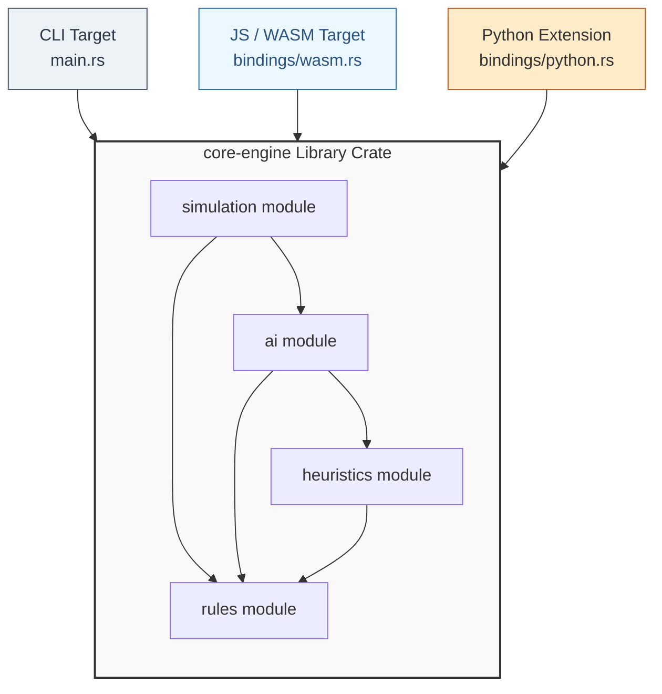

# Core Game Engine Architecture

This document outlines the architectural boundaries and responsibilities of the `core-engine` Rust crate. The architecture is split into decoupled modules handling core game rules, evaluation, automated search, high-throughput simulation, and external platform bindings.

---

## 1. Module Responsibilities

### `rules` (Rules Engine)
The pure, deterministic foundation of the game. It treats performance as a feature using bitboards.
* **Responsibilities:**
  * **Bitboard Operations:** Encapsulate state using primitive integer bitmasks (`u64`, `u128`, etc.) for lightning-fast space and computation scaling.
  * **Move Generation:** Compute pseudo-legal and legal moves via fast bitwise shifting and masking.
  * **State Mutation:** Apply legal moves to the board state (*Make/Unmake move* mechanics) and track state history (draw loops, win/loss evaluation).
* **Guiding Principle:** Zero external dependencies on other local modules. It has no concept of "strategy", "value", or "AI".

### `heuristics` (Heuristics Pipeline)
Extracts human-intuitive and mathematical features from raw board layouts.
* **Responsibilities:**
  * **Static Board Evaluation:** Provide a rapid positional score from the perspective of the active player.
  * **Feature Extraction:** Standardize board attributes (e.g., piece density, structural control, mobility) into normalized arrays/vectors.
* **Guiding Principle:** Highly coupled with the board representation (`rules`), but agnostic to how a move is decided. These features double as immediate evaluation scores for Minimax, or structural inputs for the Python Machine Learning pipeline.

### `ai` (AI Engine)
The choice-architect. It calculates or predicts the optimal move from a given state.
* **Responsibilities:**
  * **Lookahead Search:** Implement traditional tree-search algorithms (Alpha-Beta Minimax, Iterative Deepening, or MCTS) utilizing the `rules` engine for state exploration and `heuristics` for leaf-node scoring.
  * **Model Inference Engine:** Wrap an embedded model runtime (like `onnxruntime` or raw weight arrays) to query the neural network trained via Python.
* **Guiding Principle:** Accepts a board state, outputs a chosen move. It should support polymorphic selection (e.g., swapping a Minimax agent out for a Neural Network agent seamlessly).

### `simulation` (Simulation Engine)
The engine's data factory and arena.
* **Responsibilities:**
  * **Game Orchestration:** Manage a continuous game-loop from an initial state until a terminal condition is broadcast by the `rules` engine.
  * **Agent Orchestration:** Feed current states to assigned `ai` agents and execute their returned moves.
  * **Concurrent Processing:** Scale to thousands of parallel matches utilizing multi-threading primitives (e.g., Rayon) to generate high-throughput state/reward telemetry for reinforcement learning.

### `bindings` (Wasm & Python Bridge)
The translation layer converting native Rust types to foreign ecosystems.
* **Responsibilities:**
  * **WebAssembly Targets:** Map board states, valid moves, and the AI agent choices to JavaScript-friendly structures via `wasm-bindgen`.
  * **Python Extensions:** Wrap the `simulation` engine and `rules` engine via `PyO3` / `Maturin` so Python training scripts can interact with the environment like an OpenAI Gym/PettingZoo interface.

---

## 2. Component Data Flow Diagram
